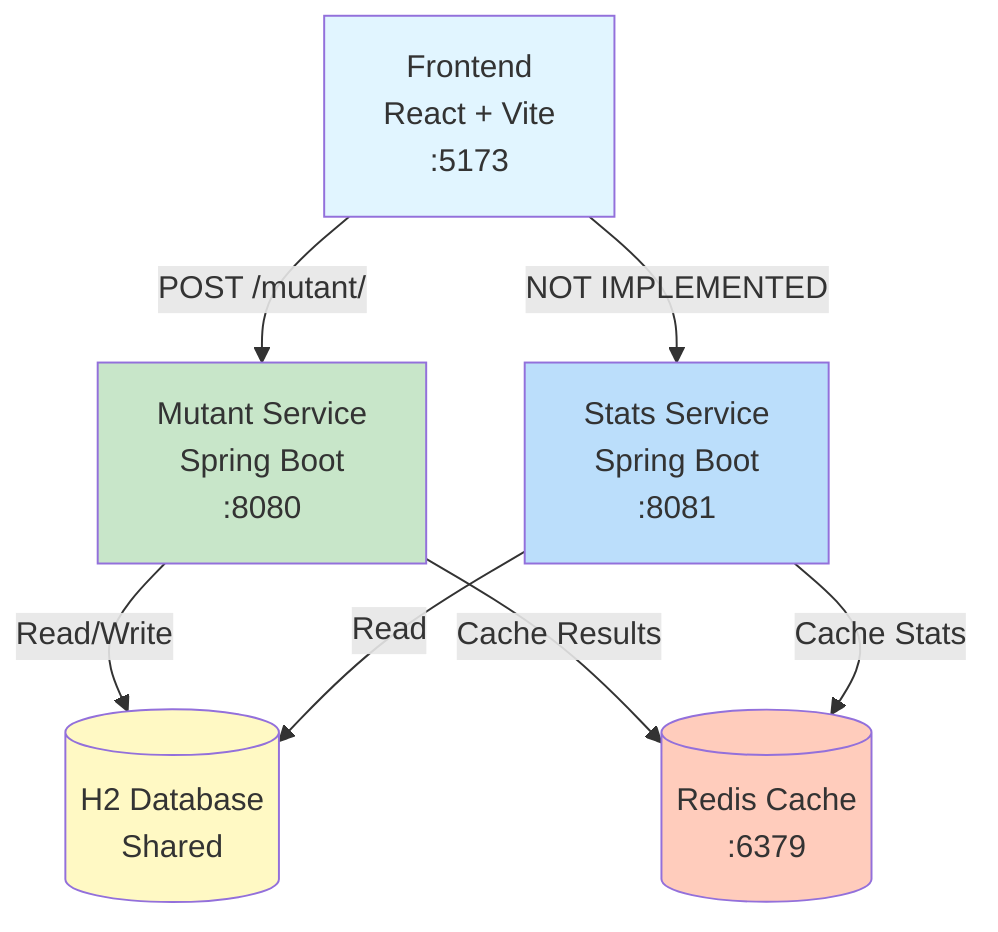

# DNA Mutant Detector

A scalable microservices system for detecting mutant DNA sequences and tracking verification statistics. Built to handle high-scale traffic with Redis caching and optimized algorithms.

---

## 🚀 Quick Start

### Prerequisites
- **Java 17+** and **Maven 3.6+**
- **Node.js 18+**
- **Redis** (optional but recommended)

### Start Redis (Recommended)
```bash
docker run -d -p 6379:6379 redis:latest
```

### Install Dependencies (First Time)
```bash
npm install
cd dna-frontend && npm install && cd ..
```

### Start All Services
```bash
npm start
```

This starts all three services with color-coded logs:
- **Mutant Service** (Port 8080) - Green
- **Stats Service** (Port 8081) - Blue
- **Frontend** (Port 5173) - Magenta

---

## Web Interface

Open **[http://localhost:5173](http://localhost:5173)**

---

## 🏗️ Architecture



**Quick Overview:**
- **Frontend** (React + Vite) → User interface
- **Mutant Service** (Spring Boot) → DNA verification + persistence
- **Stats Service** (Spring Boot) → Statistics aggregation
- **H2 Database** → Shared data storage
- **Redis** → Caching layer

---

## 📦 Services

### 1. Mutant Service
Verifies DNA sequences and persists results. **[README →](dna-demo/README.md)**

### 2. Stats Service
Provides real-time verification statistics. **[README →](stats-service/README.md)**

### 3. Frontend
React web interface for testing the system. **[README →](dna-frontend/README.md)**

---

## 🧪 Testing

**Run all tests:**
```bash
npm test
```

**Code Coverage:** JaCoCo reports generated in `target/site/jacoco/`

---

## Trade-offs & Decisions

- **Database**: Current is H2 for simplicity. Considered PostgreSQL for production.
- **Service Communication**: Shared DB for simplicity vs REST API or message queue for decoupling.
- **Caching**: Redis for performance vs added complexity.

---

## ToDos

- [ ] Use message queue (event-driven) architecture with Redis Pub/Sub to avoid StatsRepository
- [ ] Rename `dna-demo` to `mutant-service` for clarity
- [ ] Implement stats display in frontend
- [ ] Improve .claude skills for better test automation

---


## Open Questions

- Do we expect the `/mutant/` endpoint to receive aggressive traffic as well?
