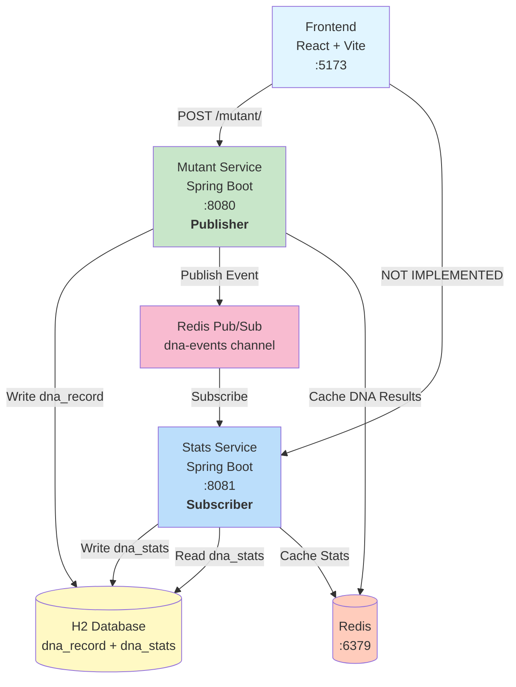

# DNA Mutant Detector

A scalable microservices system for detecting mutant DNA sequences and tracking verification statistics. Built to handle high-scale traffic with Redis caching and optimized algorithms.

---

## 🚀 Quick Start

### Prerequisites
- **Java 17+** and **Maven 3.6+**
- **Node.js 18+**
- **Redis** (REQUIRED for event-driven communication)

### Start Redis (REQUIRED)
```bash
docker run -d -p 6379:6379 redis:latest
```

**Note:** Redis is required for:
- Event-driven communication between services (Pub/Sub)
- DNA verification result caching
- Statistics caching

### Install Dependencies (First Time)
```bash
npm install
cd dna-frontend && npm install && cd ..
```

### Start All Services
```bash
npm start
```

This starts all three services with color-coded logs:
- **Mutant Service** (Port 8080) - Green
- **Stats Service** (Port 8081) - Blue
- **Frontend** (Port 5173) - Magenta

---

## Testing the System

Open **[http://localhost:5173](http://localhost:5173)**

Retrieve stats:
```bash
curl http://localhost:8081/stats/
```

---

## 🏗️ Architecture

**Event-Driven Microservices Architecture:**



**Key Architecture Decisions:**

1. **Event-Driven Communication**: Services communicate asynchronously via Redis Pub/Sub
   - dna-demo publishes `DnaVerifiedEvent` when DNA is verified
   - stats-service subscribes and updates statistics
   - Eventual consistency (~100ms delay)

2. **Service Independence**: Each service owns its data
   - dna-demo: owns `dna_record` table
   - stats-service: owns `dna_stats` table
   - Intentional code duplication (DnaVerifiedEvent) for autonomy

3. **JSON Serialization**: Events use JSON format for cross-service compatibility

4. **Caching Strategy**:
   - DNA results cached (prevents duplicate processing)
   - Stats cached with auto-eviction on updates

**Quick Overview:**
- **Frontend** (React + Vite) → User interface
- **Mutant Service** (Spring Boot) → DNA verification + event publishing
- **Stats Service** (Spring Boot) → Event processing + statistics
- **H2 Database** → Data storage (separate table ownership)
- **Redis** → Pub/Sub events + caching layer

---

## 📦 Services

### 1. Mutant Service
Verifies DNA sequences and persists results. **[README →](dna-demo/README.md)**

### 2. Stats Service
Provides real-time verification statistics. **[README →](stats-service/README.md)**

### 3. Frontend
React web interface for testing the system. **[README →](dna-frontend/README.md)**

---

## 🧪 Testing

**Run all tests:**
```bash
npm test
```

**Individual service tests:**
```bash
cd dna-demo && ./mvnw test        # 49 tests
cd stats-service && ./mvnw test   # 27 tests
```

**Code Coverage:** JaCoCo reports generated in `target/site/jacoco/` (target: 80%+)

---

## Trade-offs & Decisions

### Event-Driven Architecture
- **✅ Chosen**: Redis Pub/Sub for service communication
- **Why**: Decouples services, scales to 100-1M req/s, easy to add new consumers
- **Trade-off**: Eventual consistency (~100ms stats lag), events lost if subscriber down
- **Alternatives**: Shared DB writes (tight coupling), REST API (synchronous, higher latency)

### Intentional Code Duplication
- **✅ Chosen**: Duplicate `DnaVerifiedEvent` in both services
- **Why**: Service autonomy > DRY principle in microservices
- **Trade-off**: Manual schema compatibility maintenance
- **Alternatives**: Shared library (deployment coupling)

### JSON Serialization
- **✅ Chosen**: GenericJackson2JsonRedisSerializer for events
- **Why**: Cross-service compatibility, human-readable
- **Trade-off**: Slightly larger payload vs binary
- **Alternatives**: Java serialization (incompatible across packages)

### Database
- **✅ Current**: H2 (file-based at `/tmp/dnadb`)
- **Why**: Zero-config, fast development
- **Trade-off**: PostgreSQL would be more robust for production

### Caching
- **✅ Chosen**: Redis for both Pub/Sub and caching
- **Why**: Production-ready, already required for events
- **Trade-off**: Added infrastructure complexity

## Service Startup Order

⚠️ **IMPORTANT**: Services must start in this order:

1. **Redis** (must be running first)
2. **Stats Service** (subscribes to events)
3. **Mutant Service** (publishes events)

If started out of order, early events may be lost.

---

## Monitoring Events

Check if events are being published and consumed:

```bash
# Check subscriber count (should be 1)
docker exec <redis-container-id> redis-cli PUBSUB NUMSUB dna-events

# Monitor events in real-time
docker exec <redis-container-id> redis-cli MONITOR

# Check stats-service logs for event processing
tail -f /path/to/stats-service.log | grep "Received DNA verification event"
```

## ToDos

- [X] Use message queue (event-driven) architecture with Redis Pub/Sub to avoid StatsRepository
- [ ] Rename `dna-demo` to `mutant-service` for clarity
- [ ] Implement stats display in frontend
- [ ] Switch from Redis Pub/Sub to Redis Streams (for event persistence)

---

## Trade-offs & Decisions
Database: Current is H2 for simplicity. Considered PostgreSQL for production.

Service Communication: Shared DB for simplicity vs REST API or message queue for decoupling.

Caching: Redis for performance vs added complexity.


## Open Questions

- Do we expect the `/mutant/` endpoint to receive aggressive traffic as well?
- Should we persist events (Redis Streams) for guaranteed delivery?
- How to handle event schema evolution without breaking compatibility?
- Need monitoring/alerting for event processing failures?
